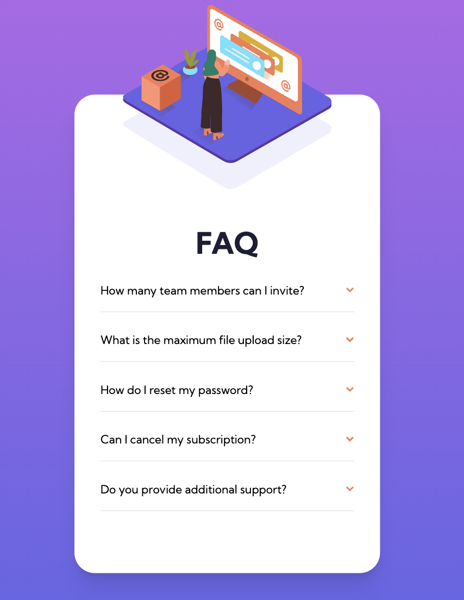
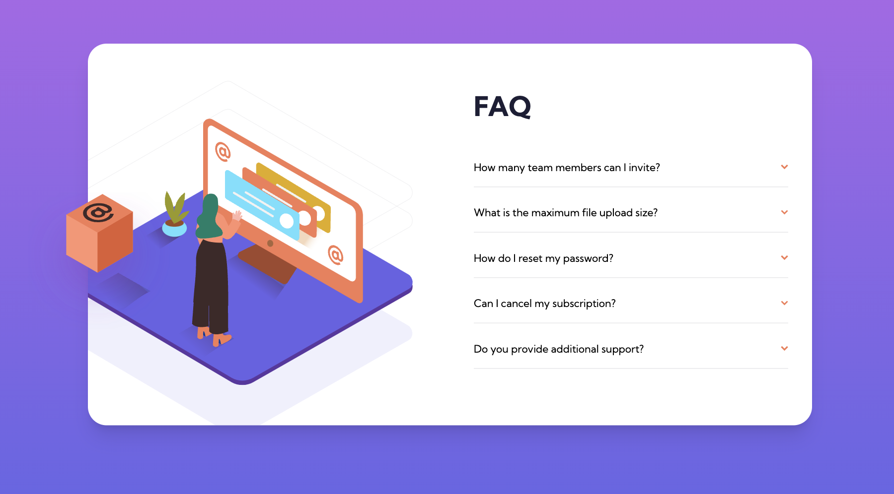

# Frontend Mentor - FAQ accordion card solution

This is a solution to the [FAQ accordion card challenge on Frontend Mentor](https://www.frontendmentor.io/challenges/faq-accordion-card-XlyjD0Oam). Frontend Mentor challenges help you improve your coding skills by building realistic projects. 

## Table of contents

- [Overview](#overview)
  - [The challenge](#the-challenge)
  - [Screenshot](#screenshot)
  - [Links](#links)
- [My process](#my-process)
  - [Built with](#built-with)
  - [What I learned](#what-i-learned)
- [Author](#author)

## Overview

### The challenge

Users should be able to:

- View the optimal layout for the component depending on their device's screen size
- See hover states for all interactive elements on the page
- Hide/Show the answer to a question when the question is clicked

### Screenshot




### Links

- Solution URL: [Add solution URL here](https://your-solution-url.com)
- Live Site URL: [Add live site URL here](https://sanderdechering.github.io/Frontend-mentor_FAQ/)

## My process

### Built with

- [Tailwind CSS](https://tailwindcss.com/) - CSS Library


### What I learned

This project was made with the Tailwind CSS library. I only used Tailwind CSS, other libraries or own css files.

 - How to make html elements react to a change in a input field with the ["peer" Tailwind CSS](https://tailwindcss.com/docs/hover-focus-and-other-states#styling-based-on-sibling-state) class.

```html
<section class="w-full py-3 grid grid-cols-6 ">
  <input id="faq_1" type="checkbox" class="peer hidden">
  <label for="faq_1" class="peer-checked:font-bold hover:text-red-500  cursor-pointer col-span-5">
    How many team members can I invite?
  </label>
  
  <p class="hidden peer-checked:block text-dark-grayish-blue pt-3 pb-2 col-span-6">
    You can invite up to 2 additional users on the Free plan. There is no limit on
    team members for the Premium plan.
  </p>
  <span class="border-light-grayish-blue border-t mt-4 col-span-6"></span>
</section>
```

- How to order absolute SVG images in a relative div
```html
<!--  SVG mobile    -->
      <div class="w-full flex justify-center mt-[-110px] lg:hidden">
        
        
      </div>
    <!--  SVG desktop    -->
      <div class="w-1/2 hidden relative lg:block">
        <div class="absolute w-full h-full overflow-hidden">
          
          
        </div>
        <div class="absolute w-full h-full">
          
        </div>
      </div>
```

## Author

- Website - [Sander Dechering](https://www.sanderdechering.com)
- Frontend Mentor - [@sanderdechering](https://www.frontendmentor.io/profile/sanderdechering)
